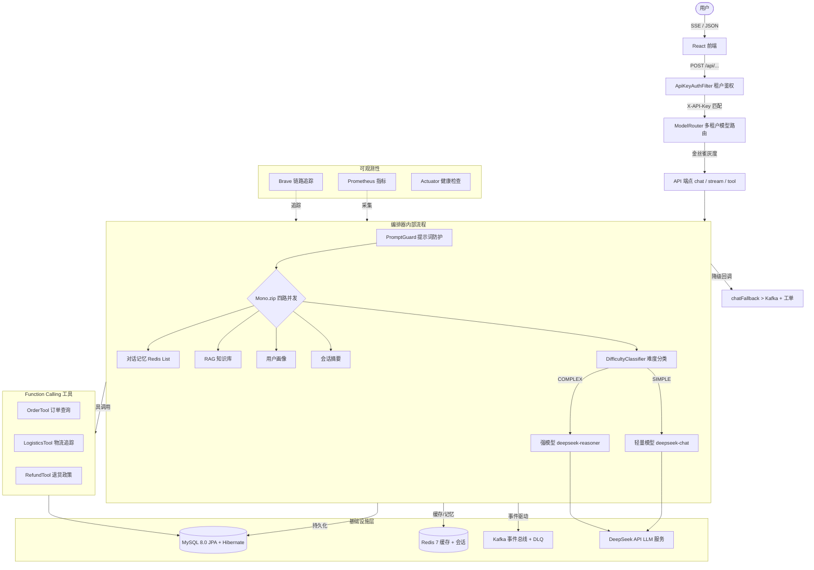
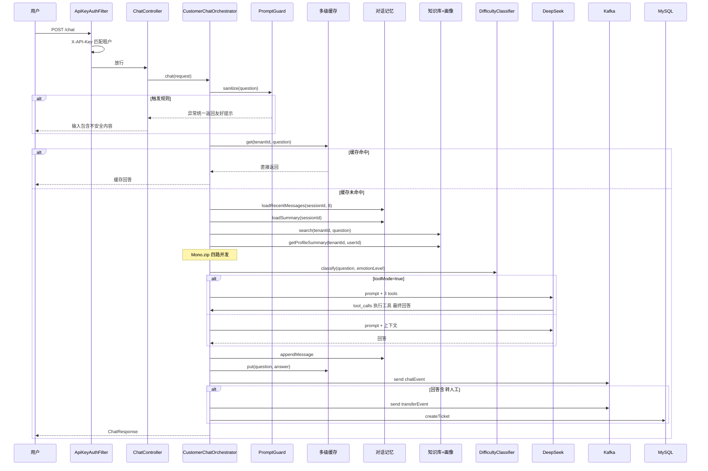
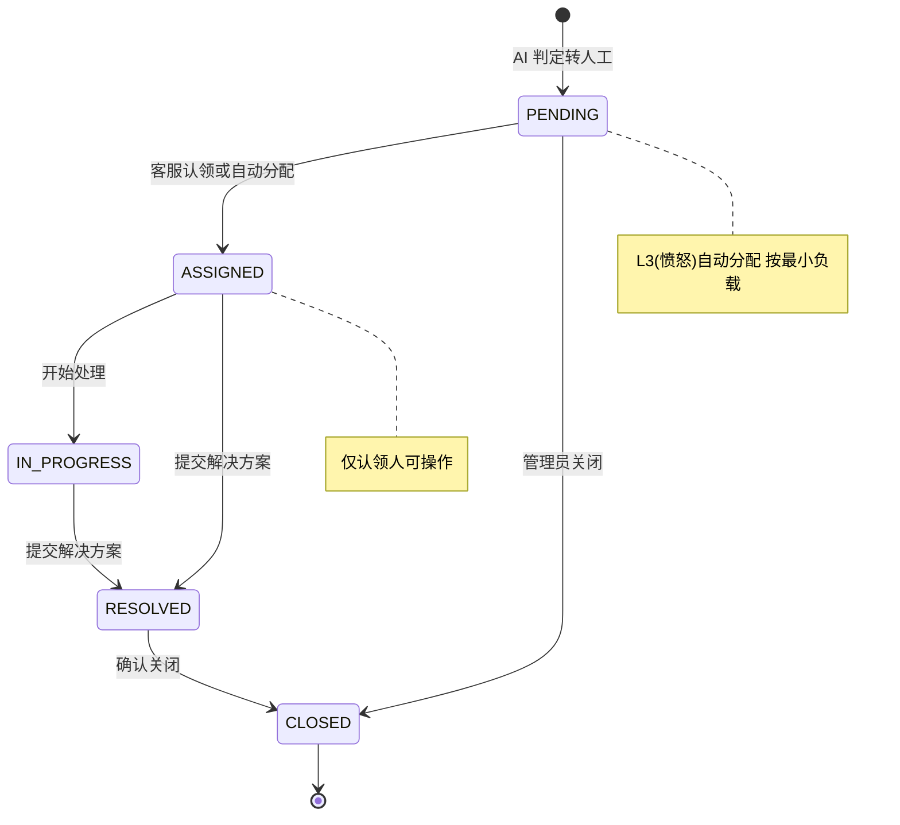
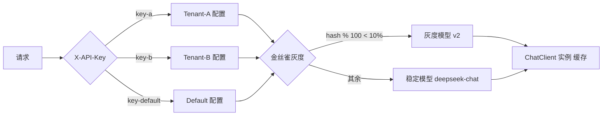
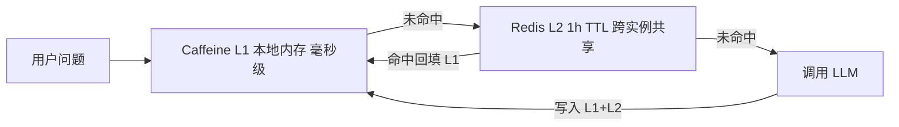
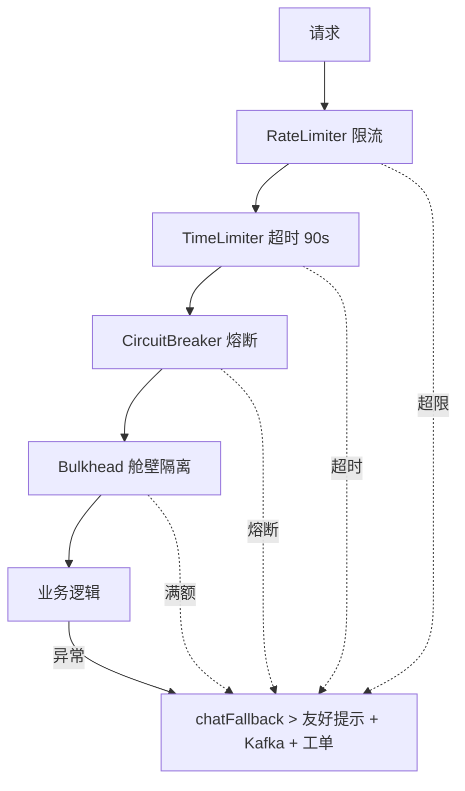

# AI 智能客服系统

生产级 AI 智能客服后端，基于 Spring Boot 3 WebFlux 响应式架构，集成 DeepSeek 大模型，支持多租户隔离、流式对话、Function Calling 工具调用与事件驱动。

---

## 系统架构



---

## 快速启动

### 前置要求

- Docker & Docker Compose
- Java 17+
- Node.js 18+
- DeepSeek API Key ([deepseek.com](https://platform.deepseek.com))

### 1. 启动基础设施

```bash
docker-compose up -d
```

### 2. 启动后端（H2 内存模式，无需 MySQL）

```bash
cd backend
export DEEPSEEK_API_KEY=sk-your-key-here
mvn spring-boot:run
```

### 3. 启动前端

```bash
cd frontend
npm install
npm run dev
```

### 4. 验证

```bash
# 健康检查
curl http://localhost:8080/actuator/health

# 测试对话
curl -X POST http://localhost:8080/api/v1/cs/chat \
  -H "Content-Type: application/json" \
  -H "X-API-Key: default-api-key-change-me" \
  -d '{"sessionId":"test-001","tenantId":"default","userId":"u1","question":"查一下订单 ORD-20240001"}'
```

---

## 核心模块设计

### 1. 对话编排流程



### 2. 工单状态机



### 3. 多租户模型路由



### 4. 缓存层级



### 5. Resilience4j 防护层



---

## 特性清单

| 特性 | 说明 |
|------|------|
| **AI 驱动对话** | 集成 DeepSeek，支持普通对话、SSE 流式、Function Calling 三种模式 |
| **多租户架构** | 租户级 API Key 认证、独立模型配置、金丝雀灰度发布 |
| **工具调用** | 订单查询/物流追踪/退货政策，LLM 自主决策调用 |
| **提示注入防护** | 30+ 正则规则过滤 SQL 注入、XSS、越狱攻击，租户级敏感词 |
| **弹性容错** | Resilience4j 限流/熔断/降级/隔离，降级自动转人工 |
| **多层缓存** | Caffeine L1 + Redis L2 两级缓存，降低 LLM 调用 |
| **事件驱动** | Kafka 异步处理对话记录与转人工事件，含死信队列 |
| **对话记忆** | Redis List 存储多轮历史，LLM 自动摘要压缩 |
| **可观测性** | Prometheus 指标 + Brave 全链路追踪 + Actuator 健康检查 |

## 技术栈

| 维度 | 技术 |
|------|------|
| **语言** | Java 17 |
| **框架** | Spring Boot 3.2, Spring WebFlux, Spring AI |
| **AI 模型** | DeepSeek Chat (兼容 OpenAI API) |
| **消息队列** | Apache Kafka + 死信队列 |
| **缓存** | Redis 7 (Reactive), Caffeine |
| **数据库** | MySQL 8.0 (JPA + Flyway), H2 (本地开发) |
| **容错** | Resilience4j (限流/熔断/隔离/超时) |
| **监控** | Micrometer, Prometheus, Brave Tracing |
| **前端** | React 18, TypeScript, Vite, Tailwind CSS, Zustand |
| **部署** | Docker Compose, Kubernetes (HPA) |

## 项目结构

```
├── backend/
│   └── src/main/java/com/cs/customerservice/
│       ├── api/controller/      # ChatController, AgentController, TicketController
│       ├── api/dto/             # ChatRequest/Response, TicketDTO
│       ├── application/orchestrator/  # CustomerChatOrchestrator (核心编排器)
│       ├── application/ai/      # DifficultyClassifier
│       ├── application/service/ # 对话记忆、多级缓存、用户画像
│       ├── application/ticket/  # TicketService, TicketAssignmentService
│       ├── application/tool/    # OrderTool, LogisticsTool, RefundTool
│       ├── infrastructure/config/   # Cache, Kafka, ChatClient, ModelRouting
│       ├── infrastructure/entity/   # JPA 实体
│       ├── infrastructure/kafka/    # 生产者/消费者/死信
│       ├── infrastructure/model/    # ModelRouter
│       ├── infrastructure/security/ # API Key / Agent Token 鉴权
│       └── infrastructure/tracing/  # TraceIdWebFilter
├── frontend/src/
│   ├── api/                     # Axios 客户端、SSE 流式处理
│   ├── components/              # Chat, Agent, Admin 组件
│   ├── hooks/                   # useChat, useStream
│   └── stores/                  # Zustand 状态管理
├── k8s/                         # Kubernetes (Deployment + HPA)
├── docker-compose.yml           # MySQL + Redis + Kafka
└── api-docs.md                  # 完整 API 文档
```

## 部署

### Kubernetes

```bash
kubectl apply -f k8s/
# 3 副本 Deployment + HPA 3-20 Pod 基于 CPU/Memory/QPS
```

---

> 完整 API 文档见 [api-docs.md](api-docs.md)
